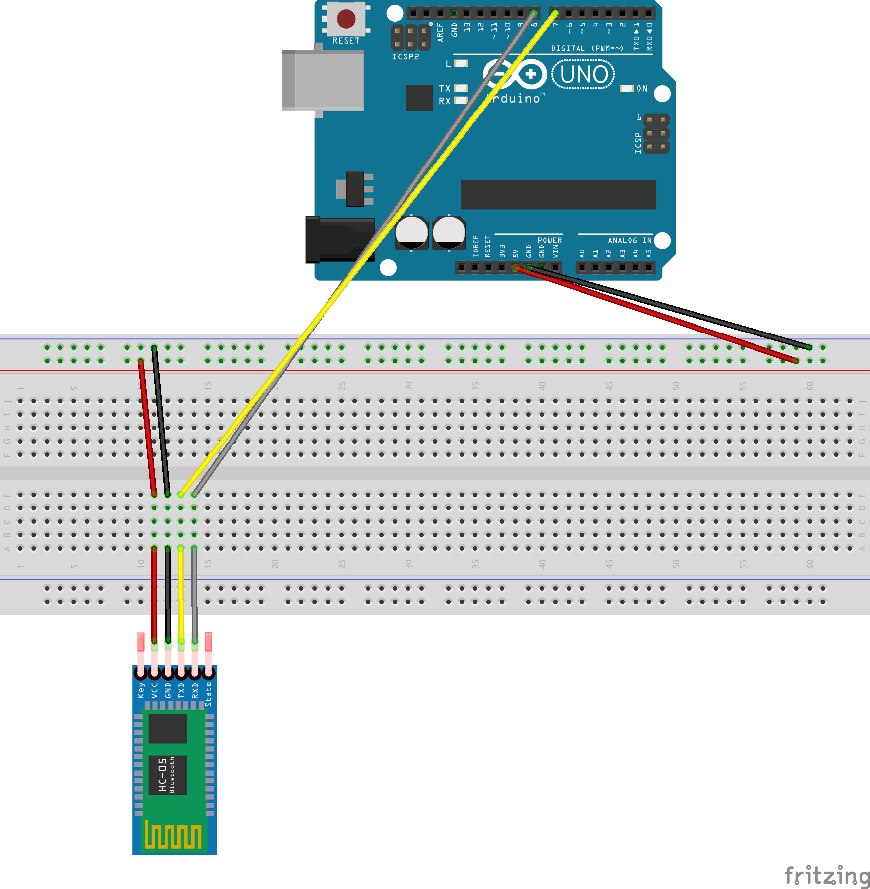

# Criando um beacon com o sensor HM-10

## Componentes necessários

- Arduino
- Protoboard
- Sensor Bluetooth 4.0 **HM-10** ([Link](https://www.itead.cc/serial-port-ble-module-master-slave-hm-10.html))

## Esquematização



## Desenvolvimento

Antes de qualquer coisa, é necessário realizar as conexões com o sensor HM-10 de acordo com a esquematização acima, se tudo estiver de acordo, você pode copiar o [código](/arduino-beacon-hm-10/arduino-code/arduino-code.ino) presente na pasta deste documento.

Existem dois métodos já prontos, que inicialmente vamos abordar apenas um, o método *detectBleBaudRate*, que é responsável por identificar e te informar a **taxa de transmissão** que o sensor HM-10 trabalha. Ele vai iterar as taxas de transmissões principais primeiramente, e logo em seguida caso não seja uma delas, ele itera as outras menos prováveis.

Esta taxa de transmissão serve para que o Arduino consiga *conversar* na mesma língua que o sensor, e todos os comandos sejam reconhecidos e traduzidos pelo sensor.

**Nota:** Não vamos abordar o passo a passo de como realizar toda a configuração do Arduino, como ligá-lo, como compilar o código e como utilizar o monitor serial dele. Isso é um outro foco, mas caso precisem de ajuda, não hesitem em abrir issues. Para mais informações, você pode verificar o tutorial abaixo:

- [Getting Started - arduino.cc](https://www.arduino.cc/en/Guide/HomePage)

----

Quando estiver com o código em mãos, compile-o para o Arduino e ele estará aguardando seus comandos. Como foi citado, cada sensor quando é comprado, vem com uma taxa de transmissão não estabelecida pelo fabricante. Portanto, no *serial monitor* do Arduino, escreva **detect** e envie para o Arduino. As informações de resposta a seguir devem ser mostradas:

```c
-----------------------------
Serial sent: detect
-----------------------------
Detecting BLE baud rate:
Checking baud rate: 9600
-----------------------------
BLE Baud Detected: 9600
-----------------------------
```

A iteração inicia a partir da linha **Detecting BLE baud rate** e itera cada taxa já estabelecida na *linha 13* do código. Assim que encontrada, haverá um separador e retornará **BLE Baud Detected: xxxx**. O número presente de taxa, deve ser então alterado nas *linhas 57 e 58* e compilar novamente o código ao Arduino.

Dependendo de qual foi a taxa recebida, altere no seu *serial monitor* a taxa correspondente e vamos começar a programar o sensor para que ele se torne um beacon.

Assim que o código for compilado, envie um comando **AT** através do *serial monitor* e ele responderá com um **OK** se estiver tudo certo. Exemplo de resposta:

```c
-----------------------------
Serial sent: AT
mySerial received: OK
-----------------------------
```

Você também pode verificar qual a versão do firmware do seu sensor, através do comando **AT+VERR?** e deve receber uma resposta semelhante:

```c
-----------------------------
Serial sent: AT+VERR?
mySerial received: HMSoft V533
-----------------------------
```

A versão do firmware recomendada são as versões 500+. Caso ele retorne uma informação inferior a esta versão, recomendo a leitura deste outro _documento_.

## Lista de comandos para tornar o sensor em um Beacon

```c
AT+RENEW // Reseta o módulo para os padrões de fábrica  
AT+RESET // Reinicia o HM-10  
AT // Comando que retorna se existe comunicação  
AT+MARJ0xnnnn // Define o valor "major" do beacon (hexadecimal)  
AT+MINO0xnnnn // Define o valor "minor" do beacon (hexadecimal)  
AT+ADVI5 // Define o padrão de envio de status (Valor 5 corresponde a 546.25 millisegundos)  
AT+NAMEMyiBeacon // Define um nome para o beacon  
AT+ADTY3 // Configura o dispositivo como não pareáve/l  
AT+IBEA1 // Habilita o modo beacon  
AT+DELO2 // Configure o beacon para apenas emitir sinais  
AT+PWRM0 // Habilita o auto-sleep para economizar energia  
AT+RESET // Reinicia o módulo
```

### Links de referência

- [Beacon como dispositivo central](http://blog.blecentral.com/2015/05/13/hm-10-central-ibeacon)
- [HM-10 as iBeacon (PDF)](https://drive.google.com/open?id=0B6UMNMtHS_pYWHpBalh4Y2U2SFU)
- [Bluetooth 4.0 BLE Module HM-10 (PDF)](https://drive.google.com/file/d/0B6UMNMtHS_pYT0V2dEswZ1ctd3M/view?usp=sharing)
